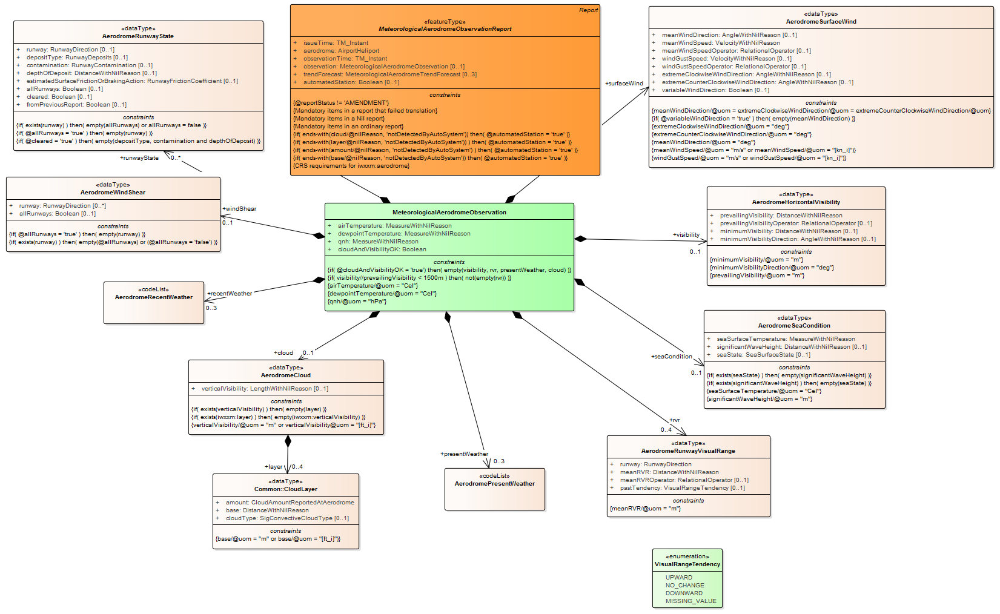
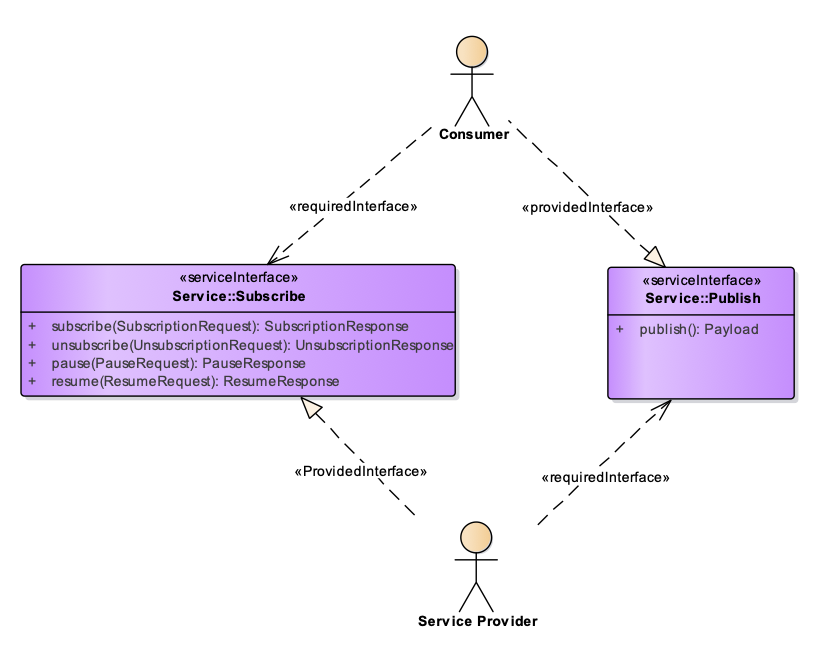

# NOTE: This is a Proof of Concept Only
---
# Service Name: Weather Observations 
##### Service Identifier: http://airservicesaustralia.aero/service/M001
---
####	Lifecycle Information

Service Version | Service Date | Service Status
--- | --- | ---
 MVP.01 |  2019-09-01 |   Experimental

---
## Service Description 

The Weather Observations data service are routine observations made at an aerodrome throughout the day and also include special (i.e., non-routine) observation made at an aerodrome as needed.

The Weather Observations are based on the Meteorological Terminal Air Report (METAR) and (SPECI) reporting constructs as defined in ICAO Annex 3 / WMO No. 49-2.

The METAR is routine weather report issued at hourly or half-hourly intervals.  It is a description of the meteorological elements observed at an airport at a specific time. 

SPECI is special weather report issued when there is significant deterioration or improvement in airport weather conditions, such as significant changes of surface winds, visibility, cloud base height and occurrence of severe weather

A typical Weather Observation contains data for the temperature, dew point, wind direction and speed, precipitation, cloud cover and heights, visibility, and barometric pressure. A METAR may also contain information on precipitation amounts, lightning, and other information that would be of interest to pilots or meteorologists such as a pilot report, colour states and runway visual range.

In addition, a short period forecast may be added at the end of the METAR covering likely changes in weather conditions in the two hours following the observation.

##	Service Functions 

The Weather Observation Data Service supports the following operational business functions:
- Monitor weather situation
- Manage airport performance
- Manage external constraints

This Data Service supports the following operational requirements:
- ICAO Annex 3
- WMO No 49-2
- Balance airport demand with resources and capabilities planning

##	Geographical Extent of Information 

The Weather Observations are available for all areodromes within the Australian Flight Information Region.

##	Source of Information 

All the original Weather Observation information is sourced from the [Australian Bureau of Meteorology](http://www.bom.gov.au).

## Quality of Service 
> Availability: 99.9%

> Capacity: 1,000 message per minuite

##	Service Verification 

The Service has be reviewed by the Australian Aeronautical Data Services Reference Group (which does not exist).

##	Access Restrictions 

The Data Service is open to any consumer to access.

There are no charges for this service.

---
##	Data Exchange Model 

The data exchange model for the Weather Observation service is shown below. 

The list of data entities and their properties  are included in the below table and their mapping to the Aeronautical Information Reference Model (AIRM).

Data Service Entity | Property | AIRM Mapping
--- | --- | ---
MeterologicalAerodromeObservationReport| | urn:aero:airm:Concept:ObservationReport
MeterologicalAerodromeObservationReport| issueTime | urn:aero:airm:Logical:timeofIssue
MeterologicalAerodromeObservationReport| aerodrome | urn:aero:airm:Logical:ICAOaerodrome
MeterologicalAerodromeObservation| | urn:aero:airm:Concept:Observation
MeterologicalAerodromeObservation| airTemperature | urn:aero:airm:Logical:airTemp
MeterologicalAerodromeObservation| cloudAndVisibility| urn:aero:airm:Logical:cloudVisibility
etc... | etc...| etc...

##	Message Exchange Pattern 

This data service supports the Publish/Subscribe message exchange pattern, including:

- A subscription interface: Containing operations that relate to the management of the service subscription (e.g. subscribe, unsubscribe, pause, resume)
- A publish interface: Dealing with the actual publication of data to consumers

The Publish/Subscribe message exchange pattern is implemented with the Advanced Message Queuing Protocol (AMQP) Version 1.0.

##	Service Interface 

##	Service Filtering 

## Service Technical Conformance  

The Data Service supports the following technical requirements:

Area | Specification | Requirement | Comment
--- | --- | --- | --
Authentication | Airservices Australia GOLD Technical Infrastructre Profile | None |
Authorisation | Airservices Australia GOLD Technical Infrastructre Profile | None |
Confidentiality | Airservices Australia GOLD Technical Infrastructre Profile | None |
Message Payload | IWWXM V3.0 | Mandatory |
Message Validation | IWWXM V3.0 | Mandatory: Validate to [METAR and SPECI XML formats](http://schemas.wmo.int/iwxxm/3.0/html/index.htm?goto=1:25)|
Message Exchange Pattern | Airservices Australia GOLD Technical Infrastructre Profile | Mandatory: [Advanced Message Queuing Protocol (AMQP) Version 1.0](http://docs.oasis-open.org/amqp/core/v1.0/os/amqp-core-overview-v1.0-os.html) |
etc | etc |  |

---
## Additional Service Information 

This data service is the first one we have ever described

---
##	Provider Organization 
> Airservices Australia

###	Provider Point of Contact 
> Data Services Team

> Email: data@airservicesaustralia.aero

> Phone: +555 555 555

###	Support Availability 
> Normal Business Hours 8AM to 6PM AEST

---
#### Service Description Provenance 
> Version: 00.02

> Last Updated: 2019-08-01

> Author: R. Iannella, Airservices

