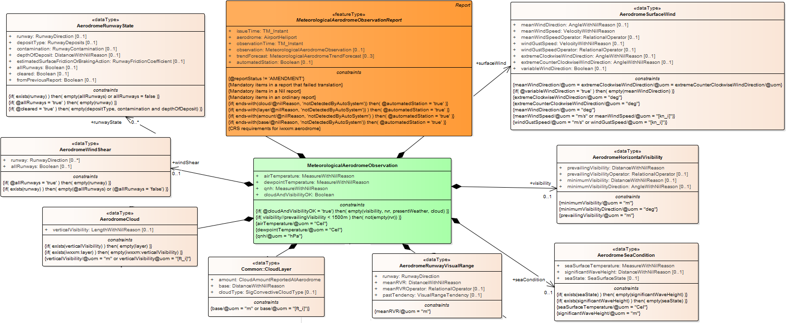
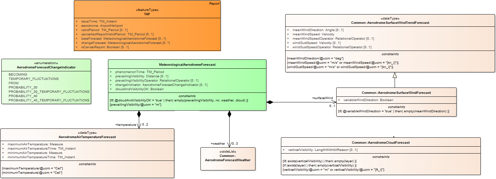

# NOTE: This is a Proof of Concept Only
---
# Service Name: Aerodrome Weather 
##### Service Identifier: http://airservicesaustralia.aero/service/M001
---
####	Lifecycle Information

Service Version | Service Date | Service Status
--- | --- | ---
 MVP.01 |  Available: 2019-10-01 |   Experimental

---
## Service Description 

The Aerodrome Weather data service includes routine observations made at an aerodrome throughout the day, special (i.e., non-routine) observation made at an aerodrome as needed, and forecast of meteorological conditions at an aerodrome, and modifications to those conditions throughout a specified period.

The Aerodrome Weather data service is based on three meterological reports:
- Aerodrome Weather Report (METAR),
- Special Aerodrome Weather Report (SPECI), and
- Aerodrome Forecast (TAF).

These reporting constructs are as defined in [ICAO Annex 3](https://store.icao.int/icao-annex-3), with extensions defined by the [Australian Bureau of Meteorology](http://www.bom.gov.au).

A METAR is a routine weather report issued at hourly or half-hourly intervals.  It is a description of the meteorological conditions observed at an airport at a specific time. 

A SPECI is special weather report issued when there is significant deterioration or improvement in airport weather conditions, such as significant changes of surface winds, visibility, cloud base height and occurrence of severe weather.

A TAF is a forecast of weather conditions at an airport, routinely issued four times a day for major civil aerodromes covering a 24- or 30-hour period, within a radius of 5NM of the airport reference point.

## Service Categories 
> **Meteorological Observation** urn:aero:airm:1.0.0:ConceptualModel:Subjects:Meteorology:MeteorologicalObservation

> **Meteorological Forecast** urn:aero:airm:1.0.0:ConceptualModel:Subjects:Meteorology:MeteorologicalForecast

> **Aerodrome** urn:aero:airm:1.0.0:ConceptualModel:Subjects:BaseInfrastructure:AerodromeInfrastructure:Aerodrome

> **METAR** urn:aero:airm:1.0.0:ConceptualModel:Subjects:AirTrafficOperations:InformationServicesProducts:MeteorologicalInformationProduct:METAR

> **TAF** urn:aero:airm:1.0.0:ConceptualModel:Subjects:AirTrafficOperations:InformationServicesProducts:MeteorologicalInformationProduct:TAF

##	Service Functions 

The Aerodrome Weather data service supports the following business functions:
- Monitor weather situation
- Manage airport performance
- Manage external constraints
- Balance airport demand with resources and capabilities planning

The Aerodrome Weather data service supports the following operational requirements:
- [ICAO Annex 3](https://store.icao.int/icao-annex-3)
- [Aeronautical Information Package (Australia)](http://www.airservicesaustralia.com/aip/aip.asp)

##	Geographical Extent of Information 

The Aerodrome Weather data service covers all aerodromes within the Australian Flight Information Region that have a METAR or a TAF service.

##	Source of Information 

The original meteorological information is sourced from the [Australian Bureau of Meteorology](http://www.bom.gov.au).

## Quality of Service 
> **Availability:** 99.9%

> **Capacity:** 1,000 messagse per minute

##	Service Verification 

The Service has been reviewed by the Australian Aeronautical Data Services Reference Group (which does not exist!).

##	Access Restrictions 

The Data Service is accessible to approved consumers and contains non-sensitive information. *(Note: this is an example only)*

---
##	Data Exchange Model 

The data exchange models for the Aerodrome Weather data service are shown below. Figure 1 shows the data entities for the  Aerodrome Weather observations (METAR and SPECI) and Figure 2 shows the Aerodrome Weather predictions (TAF).

---

> Figure 1 - METAR and SPECI Data Model

---

> Figure 2 - TAF Data Model

---

The full list of data entities and their properties  are included in the below table and their mapping to the Aeronautical Information Reference Model (AIRM).

Data Service Entity | Property | AIRM Mapping
--- | --- | ---
MeterologicalAerodromeObservationReport| | urn:aero:airm:Concept:ObservationReport
MeterologicalAerodromeObservationReport| issueTime | urn:aero:airm:Logical:timeofIssue
MeterologicalAerodromeObservationReport| aerodrome | urn:aero:airm:Logical:ICAOaerodrome
MeterologicalAerodromeObservation| | urn:aero:airm:Concept:Observation
MeterologicalAerodromeObservation| airTemperature | urn:aero:airm:Logical:airTemp
MeterologicalAerodromeObservation| cloudAndVisibility| urn:aero:airm:Logical:cloudVisibility
etc... | etc...| etc...

##	Message Exchange Pattern 

The Aerodrome Weather data service supports the Publish/Subscribe message exchange pattern, including:

- A subscription interface: Containing operations that relate to the management of the service subscription (e.g. subscribe, unsubscribe, pause, resume)
- A publish interface: Dealing with the actual publication of data to consumers

The Publish/Subscribe message exchange pattern is implemented with the Advanced Message Queuing Protocol (AMQP) Version 1.0.

##	Service Interface 

The message exchange pattern for the service supports the following interfaces:

Operation | Resouce Endpoint | Method
--- | --- | --- | --
subscribe | etc | etc
unsubscribe | etc | etc
pause | etc | etc
resume | etc | etc
publish | etc | etc

##	Service Filtering 

The Aerodrome Weather data service supports the following filtering options:

> **Aerodrome** - specify one or more ICAO Aerodrome Codes in the subscription request to filter the results to only those locations

> **Report Type** - specify one or more of "METAR", "SPECI" or "TAF" in the subscription request to filter the results to only these types of reports

One or both filters may be used in the subscription request. 

If no filtering option is specified, then all messages will be subscribed to.

## Service Technical Conformance  

The Aerodrome Weather data service supports the following technical requirements:

Area | Specification | Requirement | Comment
--- | --- | --- | --
Authentication | Airservices Australia GOLD Technical Infrastructure Profile | None |
Authorisation | Airservices Australia GOLD Technical Infrastructure Profile | None |
Confidentiality | Airservices Australia GOLD Technical Infrastructure Profile | None |
Message Payload | IWWXM V3.0 | Mandatory |
Message Validation | IWWXM V3.0 | Mandatory: Validate to [METAR, SPECI and TAF IWXXM XML schemas](http://schemas.wmo.int/iwxxm/3.0/)|
Message Exchange Pattern | Airservices Australia GOLD Technical Infrastructure Profile | Mandatory: [Advanced Message Queuing Protocol (AMQP) Version 1.0](http://docs.oasis-open.org/amqp/core/v1.0/os/amqp-core-overview-v1.0-os.html) |
etc | etc |  |

NOTE: The *Airservices Australia GOLD Technical Infrastructure Profile* will be developed soon

---
## Additional Service Information 

The Aerodrome Weather data service is the first one we have ever described!

---
##	Provider Organization 
> Airservices Australia

###	Provider Point of Contact 
> Data Services Team

> Email: data@airservicesaustralia.aero

> Phone: +555 555 555

###	Support Availability 
> Normal Business Hours 8AM to 6PM AEST

---
#### Service Description Provenance 
> Version: 00.04

> Last Updated: 2019-08-08

> [Full document revision history tracking is available](https://github.com/airservicesaustralia/registry/commits/master/service/M001.md)

